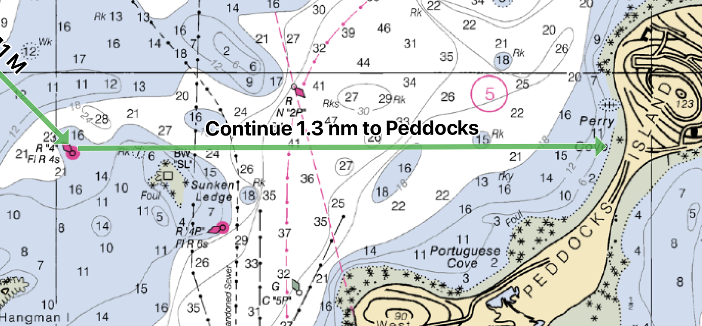

# qgis-compass-routes

This plugin creates vector layers that use magnetic variation. It also adds a couple of
custom expression functions that provide access to the underlying geomagnetic model
used by the plugin.

All actions are available as menu commands (available under **Plugins > Compass Routes**) and
as Processing scripts.

## Processing scripts

 **Create Compass Route Layer**

This menu command adds a new Line layer with memory storage, whose lines
render as arrows that are automatically labeled with distance and magnetic
heading.

The new layer, named *Routes*, is initially empty. Lines in the layer are
automatically labeled in this fashion:

The magnetic variation for each label is dynamically computed from a geomagnetic model,
using the current date.  Altitude is ignored; magnetic variation is computed at sea level.

Note that you must create only one line per feature. Multi-lines with multiple
segments are not labeled nicely, and the label reflects the total length and
bearing of the multi-line, rather than of each segment.

An explicit `label` attribute is created for each feature, normally left blank. If set,
this custom text will replace the automatically computed label:

Hovering over a line always shows its length and magnetic/true bearings
regardless of any custom label.

The following virtual fields are available for each feature in the layer:
- `bearing_true` and `bearing_magnetic` are the feature bearings in degrees for true and magnetic respectively.
- `label_true` and `label_magnetic` are the default labels incorporating distance and bearing, for true and magnetic respectively.

### Create Magnetic North Lines

This processing script adds a vector layer containing magnetic north lines
within a given extent. Lines are spaced by a given distance and are broken and
redrawn to preserve this spacing within an error tolerance.

Altitude is ignored; the variation is computed at sea level.

Parameters to the script are as follows:

*Extent* is the rectangle within which lines will be added. It's typically
convenient to use the dropdown to default this to the map canvas view area, or
to draw a rectangle on the map canvas.

*Units of measure* provides the units in which the various other
distance-related parameters are expressed. It defaults to nautical miles.

*Distance between adjacent lines* gives the parallel distance between adjacent
magnetic north lines. This distance is only approximate as field lines will
converge as traced towards the magnetic poles: the plugin preserves the
accuracy of variation at the expense of line spacing.

*Tracing resolution of field lines* governs the resolution of field lines.
Each line is created by repeatedly advancing at roughly this interval along
the field, yielding a number of points. These are then connected to form an
approximation to the field line.

*Maximum distance error between lines* specifies the largest error in line
spacing that will be tolerated before a traced line is ended and a new one
begun at the proper distance from the previous one. (Note that lines are
traced from south to north, so the initial spacing is correct on the south
side of the extent.) Providing zero for this parameter, forces lines to be
generated continuously with no breaks and with unpredictable spacing on the
north of the extent.

*Maximum variation error within a lines* specifies the largest error in magnetic
variation that will be tolerated before a traced line is ended and a new one
begun at the current point. This does not create a visual break, but does
result in a new line object whose variation tool tip (or label, if desired)
will remain accurate to within the given tolerance.

*Output layer* is a vector layer in which the results will be placed. The CRS
of the layer is always EPSG:4326 regardless of the project CRS.

An example of a generated grid at a small scale looks like this (accepting the
defaults for a 1 nm spacing):

At a larger scale, the breaking of lines to preserve distance spacing looks like this (each line
is labeled with its variation for clarity):

## Expression Functions

These functions may be used for dynamic computation of magnetic variation in QGIS expressions.

### `magnetic_north(lat, long [,altitude [,date]])`

Obtains the magnetic variation at some given coordinates.

* `lat` -- latitude as a number in signed degrees
* `long` -- longitude as a number in signed degrees
* `altitude` -- optional altitude in meters; defaults to zero
* `date` -- a date or time at which the variation should be computed
 
### `to_magnetic(bearing, lat, long [,altitude])`

Converts a true bearing at some given coordinates to a magnetic bearing in the range 0-360,
for the current date.

* `bearing` -- a true bearing in degrees
* `lat` -- latitude as a number in signed degrees
* `long` -- longitude as a number in signed degrees
* `altitude` -- optional altitude in meters; defaults to zero

## Credits

For dynamic computation of magnetic declination, uses the `geomag` package by Christopher Weiss - see https://github.com/cmweiss/geomag

Adapted from the geomagc software and World Magnetic Model of the NOAA Satellite and Information Service, [National Geophysical Data Center](http://www.ngdc.noaa.gov/geomag/WMM/).

Model values by NCEI Geomagnetic Modeling Team and British Geological Survey. 2019. World Magnetic Model 2020. NOAA National Centers for Environmental Information. [doi: 10.25921/11v3-da71](https://doi.org/10.25921/11v3-da71), 2020.
